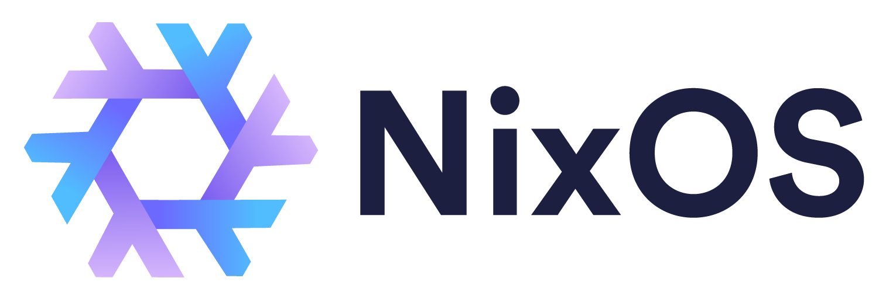

# Fractal-tess's NixOS Configuration

A comprehensive NixOS configuration featuring a modern desktop environment with development tools, gaming support, and robust system management.

## Core Features

### System

- **Hyprland** - Modern Wayland compositor with multi-monitor support
- **Waybar** - Customizable status bar with system monitoring
- **ReGreet** - Secure login manager with background customization
- **SOPS** - Encrypted secrets management for sensitive data

### Development

- **Multi-language Development Shells** - Rust, Python, Java, JavaScript, C#, Go, PHP, Unity, Tauri, React Native, MAUI
- **Neovim** - Advanced text editor with language servers
- **Git Integration** - Enhanced version control with GitHub CLI
- **Direnv & Zoxide** - Environment and directory management

### Virtualization & Containers

- **Docker** - Container runtime with rootless support
- **Portainer** - Web-based container management
- **Jellyfin** - Media server with hardware acceleration
- **Netdata** - Real-time system monitoring

### Gaming & Multimedia

- **Steam** - Gaming platform with Proton/Wine support
- **Hardware Acceleration** - NVIDIA and AMD GPU support
- **FFmpeg** - Complete multimedia processing

### Networking & Storage

- **Samba** - File sharing and network mounts
- **SSH** - Secure remote access
- **Automount** - Automatic drive mounting
- **Backup System** - Automated container backups with rotation

## Hosts

- **neo** - Laptop
- **vd** - Desktop (Main system)

## Quick Start

1. Clone this repository
2. Customize the configuration for your needs
3. Build and deploy with NixOS

## Configuration Structure

- **modules/** - Reusable NixOS modules
- **hosts/** - Host-specific configurations
- **config/** - Application configurations (Hyprland, Waybar, etc.)
- **overlays/** - Custom package modifications
- **secrets/** - Encrypted secrets and SSH keys
- **shells/** - Development environment flakes

---

_Built with NixOS_
