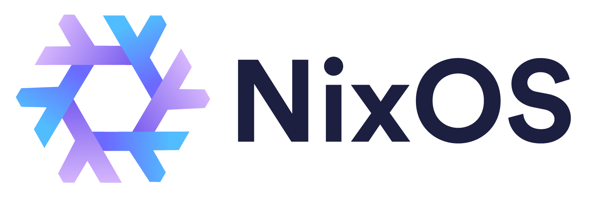

# Fractal-Tess's NixOS Configuration



A modular NixOS and Home Manager configuration for three systems, with shared desktop, development, gaming, networking, and service modules.

## Highlights

- **Hyprland desktop** with Waybar and ReGreet
- **Home Manager** for user applications and dotfiles
- **SOPS** for encrypted secrets management
- **Development shells** for Rust, Python, Go, JavaScript, Java, C#, C, PHP, Tauri, React Native, Unity, pentesting, and Playwright
- **Containers and virtualization** with Docker and related services
- **Custom packages and fixes** through Nix overlays

## Hosts

| Host | Type |
| --- | --- |
| `vd` | Desktop |
| `neo` | Laptop |
| `kiwi` | Laptop |

## Repository Layout

- `hosts/` — host-specific NixOS and Home Manager configuration
- `modules/nixos/` — reusable system modules
- `modules/home-manager/` — reusable user modules
- `config/` and `dotfiles/` — application configuration
- `overlays/` — package overrides and additions
- `scripts/` — system and development utilities
- `secrets/` — SOPS-encrypted secrets
- `shells/` — language-specific development flakes

## Usage

Build a host configuration from the repository root:

```sh
sudo nixos-rebuild build --flake .#<hostname> --impure
```

Replace `<hostname>` with `vd`, `neo`, or `kiwi`.

Apply the local host configuration with the repository helper:

```sh
./scripts/nixos/update
```

> This is a personal configuration. Review host settings, hardware configuration, users, and secrets before adapting it to another machine.

---

_Built with NixOS_
